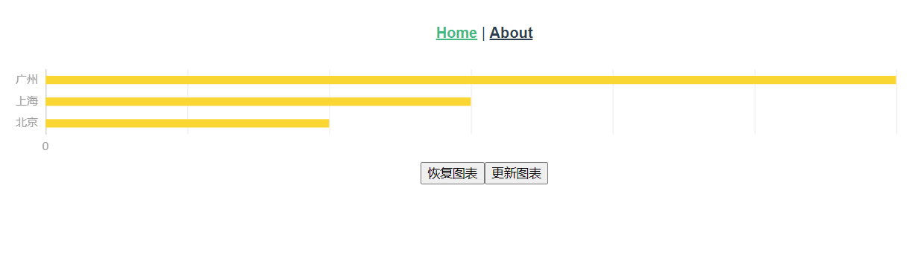

# vue2-echarts-practice

Vue2中ECharts简单封装的一种实践

## Project setup

原文见： https://juejin.cn/post/7303587697100242982 Vue2中ECharts简单封装的一种实践-详细版

## 环境
node 14.19.3 + npm
## 技术栈
vue2 

TODO 待更新
deadline 2024-07-07

TODO vue3封装
TODO react封装
